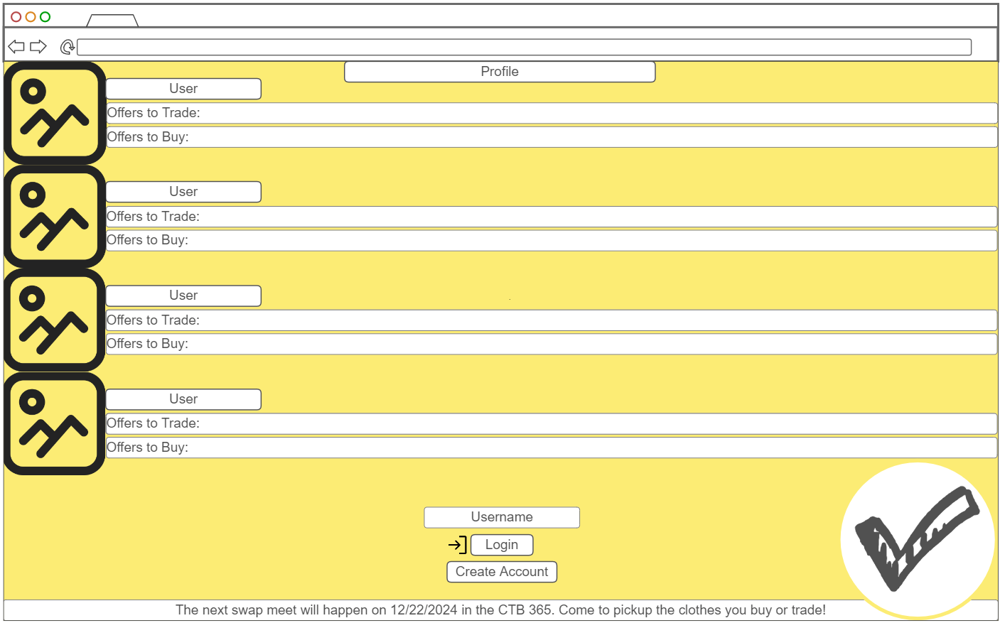
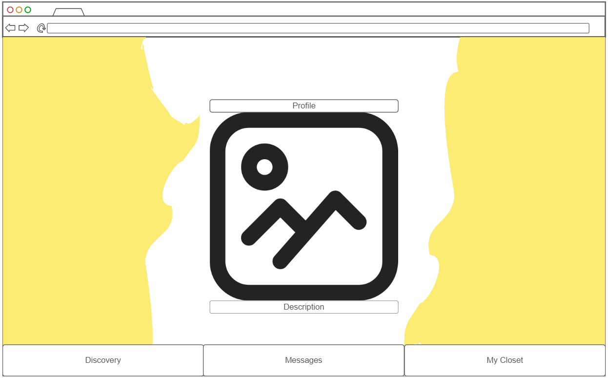

# Zufas

## Table of Contents:
- [Elevator Pitch](#elevator-pitch)
- [Design](#design)
- [Usage of Technologies](#usage-of-technologies)
  - [Using HTML](#using-html)
  - [Using CSS](#using-css)
  - [Using JavaScript](#using-javascript)
  - [Using React](#using-react)
  - [Using Backend Service](#using-backend-service)
  - [Using Databases/Logins](#using-databaseslogins)
  - [Using WebSockets](#using-websockets)

## Elevator Pitch

Have you ever opened your drawers to pick out a shirt in the morning, and you end up picking the shirt that you wore last week even though you have 20 other shirts in there that you have not worn in over a year? Or maybe that pair of shorts sits there because they are just a little bit too short for you, but they are pretty nice so you don't want to just throw them away for nothing.

We go through a vicious cycle of giving our clothes to goodwill or DI and then buying more clothes that we may not even end up wearing. Zufas would change this. Zufas is a platform where you post pictures of your clothes, and then people can offer to trade their clothes for yours, or just buy them. This eliminates the need for wasting money, and helps you to connect with others to see what is in their 'closet'.

Zufas connects you with people while helping you to better your wardrobe for FREE. Your favorite shirt or pair of pants is sitting in someone elses closet!

## Design

## Usage of Technologies

- **HTML** - Uses four HTML pages total in correct code structures. One will be used to login, one will be used for the home/discovery page, one for direct messages, and the last will be for their profile.
- **CSS** - Application styling that works visually on different screen sizes. Variety of color and transitions.
- **React** - Build dynamic interfaces with a component-based approach. Will use react state management features.
- **Service** - Backend service using the following endpoints:
  - Login endpoint
  - Posts endpoint
  - Messages endpoint
  - Profile endpoint
- **DB/Login** - Store old and new users and photos in the database. Credentials securely stored in database. No access to anything unless authenticated.
- **WebSocket** - Enable real-time communication

## Using HTML

For this deliverable, I built out the structure of my application using HTML.

- **HTML Pages**: Four HTML pages:
  - **Login Page**: Contains forms for user login.
  - **Discovery Home Page**: Displays a list of posts from all users.
  - **Messages Page**: Includes chat interface for sending and receiving messages.
  - **Profile Page**: Shows the user's uploaded pictures and profile information.

- **Links**:
  - **Login Page**: Links to the Discovery Home Page after successful login.
  - **Discovery Home Page**: Links to individual user profiles and the Messages Page.
  - **Messages Page**: Links back to the Discovery Home Page and the Profile Page.
  - **Profile Page**: Links to the Discovery Home Page and Messages Page.

- **Text**:
  - **Discovery Home Page**: Describes each post, including titles and content.
  - **Messages Page**: Displays conversation text and message timestamps.
  - **Profile Page**: Includes text descriptions of user-uploaded images and profile information.

- **Images**:
  - **Discovery Home Page**: Displays images of clothing articles or other posts.
  - **Profile Page**: Shows user-uploaded pictures.

- **DB/Login**:
  - **Login Page**: Includes input fields for username and password, and a sign in/create account button.
  - **Discovery Home Page**: Displays posts pulled from the database.

- **WebSocket**:
  - **Messages Page**: Real-time updates for incoming and outgoing messages.

## Using CSS

For this deliverable, I properly styled the application into its final appearance.

- **Header, Footer, and Main Content Body**:
  - **Header and Footer**: Styled for consistent appearance across all pages with proper spacing and alignment.
  - **Main Content**: Organized like a scroll for a clean and responsive design.

- **Navigation Elements**:
  - Changed colors for better visibility and user experience.

- **Responsive Design**:
  - Media queries to ensure the application looks great on all devices.

- **Application Elements**:
  - Used contrasting colors and ample whitespace for readability and visual appeal.

- **Application Text Content**:
  - Applied consistent fonts and text sizes for a cohesive look across the application.

- **Application Images**:
  - Styled images to fit well within their containers, with appropriate margins and alignment.

## Using JavaScript

For this deliverable, I implemented the application logic and dynamic features using JavaScript.

- **Event Handling**:
  - Implemented JavaScript functions to handle user interactions such as form submissions, button clicks, and message sending.

- **Dynamic Content**:
  - Used JavaScript to dynamically update content based on user actions, such as displaying posts or messages.

- **API Integration**:
  - Incorporated `fetch` API calls to the backend services for login, fetching posts, sending messages, and retrieving user profiles.

- **Real-Time Updates**:
  - Implemented polling or other techniques to handle real-time updates where WebSocket is not yet integrated.

## Using React

For this deliverable, I used React to build dynamic user interfaces and manage application state.

- **Components**:
  - **Login Component**: Handles user authentication.
  - **Discovery Component**: Displays a list of posts with links to user profiles.
  - **Messages Component**: Manages the chat interface.
  - **Profile Component**: Shows user’s uploaded images and profile information.

- **Router**:
  - Use React Router for navigation between the Login Page, Discovery Home Page, Messages Page, and Profile Page.

## Using Backend Service

For this deliverable, the backend services support application functionality.

- **Endpoints**:
  - **Login Endpoint**: Authenticates users and manages sessions.
  - **Posts Endpoint**: Retrieves and manages posts.
  - **Messages Endpoint**: Handles sending and receiving messages.
  - **Profile Endpoint**: Manages user profile information and uploaded pictures.

- **API Integration**:
  - Used HTTP methods (`GET`, `POST`, `PUT`, `DELETE`) to interact with the frontend and handle data operations.

## Using Databases/Logins

For this deliverable, I set up the database and managed user authentication.

- **Database Setup**:
  - **MongoDB Atlas**: Created and configured the database for storing user data and posts.

- **User Registration**:
  - Implemented user registration to create new accounts and securely store credentials.

- **Existing Users**:
  - Managed login sessions and user data retrieval for existing users.

- **Data Storage**:
  - Stored user credentials and posts securely in the database with encryption for sensitive information.

- **Access Control**:
  - Ensured that users cannot access certain features (like posting or messaging) until they are authenticated.

## Using WebSockets

For this deliverable, I implemented real-time communication using WebSocket.

- **WebSocket Connection**:
  - **Backend**: Set up WebSocket server to handle connections and broadcast messages.
  - **Frontend**: Integrated WebSocket client to receive real-time updates.

- **Real-Time Updates**:
  - **Messages Page**: Updated chat interface in real-time with new messages.
  - **Discovery Home Page**: Potentially implemented real-time updates for new posts if applicable.

